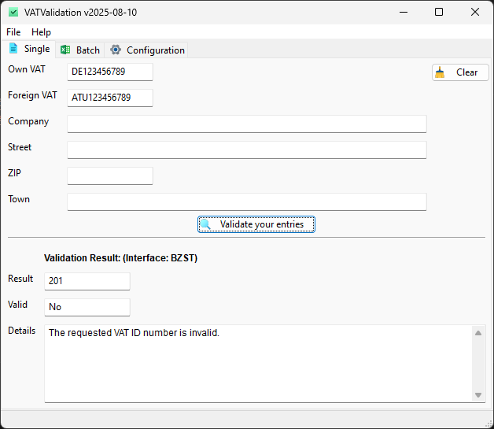
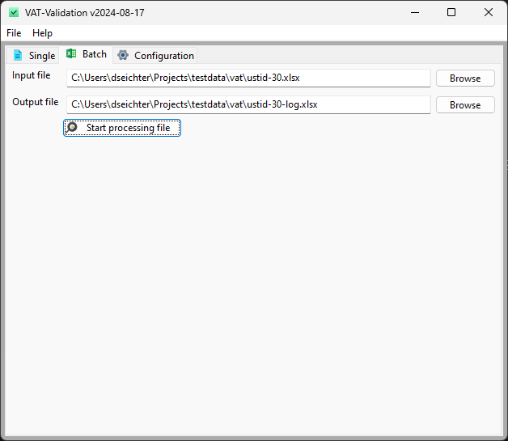
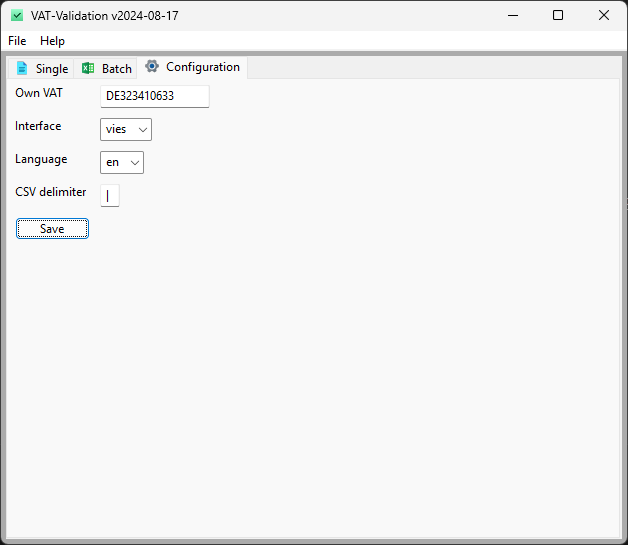

# VATValidation

[](https://github.com/dseichter/VATValidation/blob/main/README.md)
[](https://github.com/dseichter/VATValidation/blob/main/README-de.md)


[](https://sonarcloud.io/summary/new_code?id=dseichter_VATValidation)

Validate VAT numbers using the interfaces of BZSt, VIES and/or HMRC. Provides single or batch validation with support for CSV, XLSX and JSON.

## Features

* Graphical user interface
* Single validation
* Batch processing of CSV, JSON or XLSX
* Validation using BZSt (configurable, can only be used if your VAT starts with `DE`)
* Validation using VIES (configurable)
* Validation using HMRC (if you want to validate a vat starting with `UK`)
* Batch processing can be run using CLI interface (see releases)
* **NO** dependencies needed

This is the successor of my VAT-Validation. Now released as Open Source.

If you like this software, please don't hesitate to give it a :star: or send me a :moneybag: donation in the amount you think the software is worth.

## About

VAT Validation supports you in validating your vat numbers based on your master data. Whether you want to check a VAT number directly at your workplace or integrate it into your ERP/CRM applications.

## Command Line tool

If you want to check batch files (e.g. json, csv or XLSX) you can download the releases like `VATValidation-cli-windows-v2024-07-08.exe` and rename it to vatvalidation_cli.exe.

Just run the tool and by providing an input and an output file. For further information, please run

``vatvalidation_cli.exe``

```shell
usage: vatvalidation_cli.py [-h] [--version] --input INPUT --output OUTPUT

VAT-Validation CLI - v2024-07-06

options:
  -h, --help       show this help message and exit
  --version        show version of and exit
  --input INPUT    Input filename for VAT numbers.
  --output OUTPUT  Output ffilename for validation results.

For more information, visit our GitHub repository: https://github.com/dseichter/VATValidation License: GPL 3.0 - see LICENSE file at the root of the repository for details.
```

Only batch processing is provided.

## Graphical User Interface

The VAT Validation provides a graphical user interface for single and batch validation. It can be used on every workplace and does not need to be installed or any other 3rd party components.

### Single Validation

You can use the software at your workplace and check directly against the official supported interfaces of BZSt, VIES and/or HMRC.



### Batch Validation

Export your master data into a file (JSON, XLSX or CSV) format and check them completly. The codepage should be UTF-8.



The imported files needs to include the following fields/columns. In case of CSV and XLSX, please add the field names into the first row. Do not add more columns.

* key1
* key2
* ownvat
* foreignvat
* company
* street
* zip
* town

The output file (logfile) contains the following information:

* key1
* key2
* ownvat
* foreignvat
* type
* valid
* errorcode
* errorcode_description
* valid_from
* valid_to
* timestamp
* company
* address
* town
* zip
* street

Depending on your imported data and used interface, some keys won't have values.

## Configuration

The configuration is done really simple. Change to the configuration tab and enter your own vat. This will be used for the single validation as default VAT. 
Next to this, you can choose your default interface. If you own a german VAT, it is recommended to use BZSt. Change the language of your output.



In case you are using CSV, you can choose the delimiter for your import and export files.

# Known issues

At the moment there are several known issues. You will find them in the issues. If you encounter any further issue, please add an issue.

# Contributing

If you want to contribute by fixing an issue, add a new function or just optimize something, a simple instruction how to start development.

## Start development

Create and activate an environment by running the following command:

```python -m venv .venv```

```.venv/Scripts/activate```

Install the required dependencies

```pip install -r src/requirements.txt```

If you want to do some UI changes, download and install the latest wxFormBuilder from the [wxFormBuilder Homepage](https://github.com/wxFormBuilder/wxFormBuilder).

You can start the VATValidation by running the following command:

```python src/vatvalidation.py```
