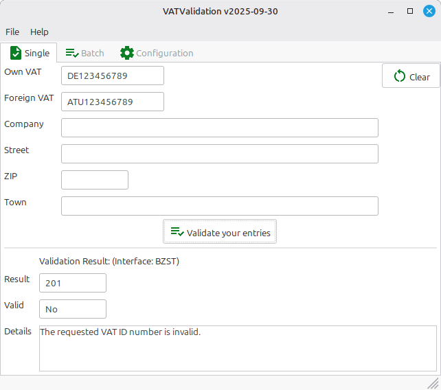

# VATValidation

**VATValidation** is a powerful, open-source tool for validating VAT numbers using the official interfaces of VIES and HMRC. It supports both single and batch validation with CSV, XLSX, and JSON formats.

  

  
  
  

  <b><a href="https://dseichter.github.io/VATValidation/">Documentation</a></b> •
  <b><a href="https://github.com/dseichter/VATValidation/releases">Downloads</a></b> •
  <b><a href="https://github.com/dseichter/VATValidation/issues">Issues</a></b>

---

Binaries for Windows and Linux are available in the <a href="https://github.com/dseichter/VATValidation/releases">releases</a>.

---

## 🚀 Features

- 🖥️ Graphical user interface
- ✅ Single VAT number validation
- 📦 Batch processing of CSV, JSON, or XLSX
- 🇪🇺 Validation using VIES (EU VAT numbers)
- 🇬🇧 Validation using HMRC (check UK VAT numbers)
- 🛠️ CLI batch processing (see releases)
- 🔒 **NO** external dependencies required

---

> This is the successor of my VAT-Validation. Now released as Open Source!

If you like this software, please give it a ⭐ or send a 💰 donation in the amount you think the software is worth.

---

## 📚 Documentation

For full documentation, usage instructions, configuration, screenshots, and contributing guidelines,  
please visit the [project documentation](https://dseichter.github.io/VATValidation/).

---

## 📄 License

GPL 3.0 — see [LICENSE](LICENSE) file at the root of the repository for details.

## Icons

VATValidation uses [Google Material Symbols](https://fonts.google.com/icons) within its code for UI icons.  
Material Symbols are licensed under the [Apache License 2.0](https://github.com/google/material-design-icons/blob/master/LICENSE) and are free for use in open source projects.