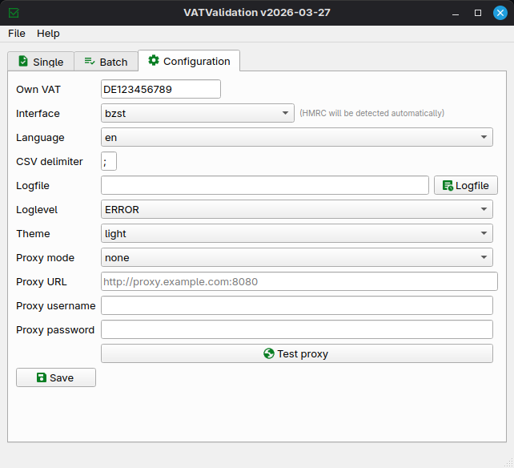

# Konfiguration

Die Konfiguration ist sehr einfach. Wechseln Sie auf die Registerkarte Konfiguration und geben Sie Ihre eigene Mehrwertsteuer ein. Diese wird für die einmalige Validierung als Standard-Mehrwertsteuer verwendet. 
Daneben können Sie Ihre Standardschnittstelle auswählen. Ändern Sie die Sprache Ihrer Ausgabe.

Falls Sie CSV verwenden, können Sie das Trennzeichen für Ihre Import- und Exportdateien wählen.

## Proxy-Konfiguration

VATValidation unterstuetzt drei Proxy-Modi:

- `none`: Kein Proxy wird verwendet.
- `system`: Proxy-Einstellungen des Betriebssystems bzw. der Umgebungsvariablen verwenden.
- `manual`: Proxy-URL und optionale Zugangsdaten aus der Konfiguration verwenden.

Sie koennen Ihre aktuelle Proxy-Konfiguration direkt in der GUI testen:

1. Oeffnen Sie den Reiter **Konfiguration**.
2. Setzen Sie den **Proxy mode**.
3. Falls der Modus `manual` ist, setzen Sie **Proxy URL** (zum Beispiel `http://127.0.0.1:8080`) und optional Zugangsdaten.
4. Klicken Sie auf **Test proxy**.

Der Proxy-Test prueft alle konfigurierten Validierungsendpunkte (VIES, HMRC, BZSt, Swiss UID) und zeigt pro Endpunkt Erfolg oder Fehler an.

## Schlüssel der Konfigurationsdatei

Die Konfiguration wird in `config.json` mit den folgenden Schlüsseln gespeichert:

| Schlüssel | Typ | Beschreibung | Beispiel |
|-----------|-----|-------------|---------|
| `delimiter` | string | Trennzeichen für CSV-Import/-Export | `"|"` |
| `interface` | string | Standardvalidierungsschnittstelle | `"vies"` |
| `language` | string | Sprache der Benutzeroberfläche | `"de"` |
| `logfilename` | string | Pfad zur Protokolldatei | `"/tmp/vatvalidation.log"` |
| `loglevel` | string | Protokollierungsstufe (DEBUG, INFO, WARNING, ERROR) | `"ERROR"` |
| `proxy_mode` | string | Proxy-Modus (`system`, `manual`, `none`) | `"none"` |
| `proxy_url` | string | Proxy-URL fuer manuellen Modus | `"http://127.0.0.1:8080"` |
| `proxy_username` | string | Benutzername fuer Proxy-Authentifizierung | `"user"` |
| `proxy_password` | string | Passwort fuer Proxy-Authentifizierung | `"secret"` |
| `theme` | string | Anwendungsdesign (system, light, dark) | `"system"` |
