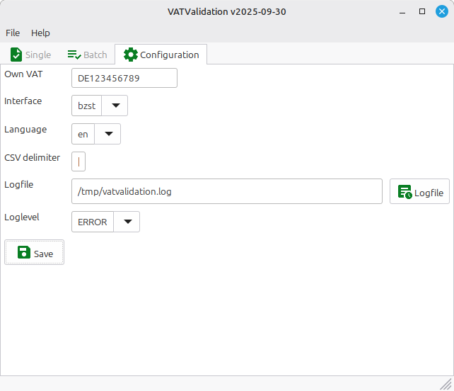

# Konfiguration

Die Konfiguration ist sehr einfach. Wechseln Sie auf die Registerkarte Konfiguration und geben Sie Ihre eigene Mehrwertsteuer ein. Diese wird für die einmalige Validierung als Standard-Mehrwertsteuer verwendet. 
Daneben können Sie Ihre Standardschnittstelle auswählen. Wenn Sie eine deutsche MwSt. besitzen, empfehlen wir die Verwendung von BZSt. Ändern Sie die Sprache Ihrer Ausgabe.

Falls Sie CSV verwenden, können Sie das Trennzeichen für Ihre Import- und Exportdateien wählen.
