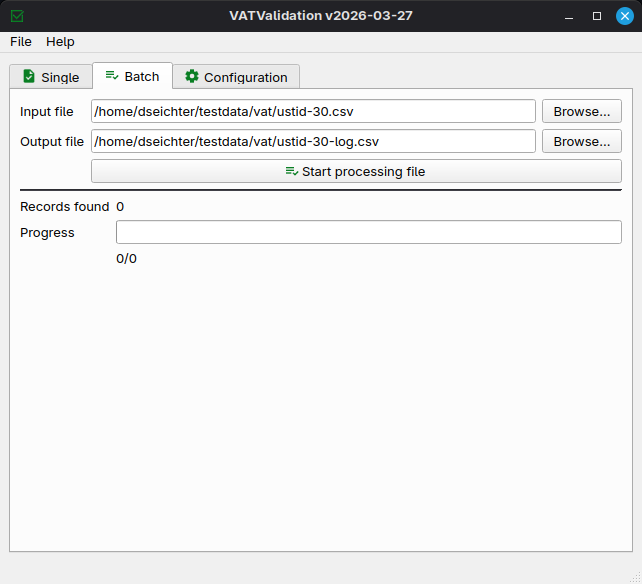

# Grafische Benutzeroberfläche

VATValidation bietet eine grafische Benutzeroberfläche für Einzel- und Stapel-Validierung. Sie kann an jedem Arbeitsplatz verwendet werden und muss nicht installiert werden, und es sind keine weiteren Komponenten von Drittanbietern erforderlich.

## Einzelvalidierung

Sie können die Software an Ihrem Arbeitsplatz einsetzen und direkt gegen die offiziell unterstützten Schnittstellen von  VIES und/oder HMRC prüfen.

## Stapelverarbeitung

Exportieren Sie Ihre Stammdaten in eine Datei (JSON, XLSX oder CSV) und überprüfen Sie sie vollständig. Die Codepage sollte UTF-8 sein.

Die importierten Dateien müssen die folgenden Felder/Spalten enthalten. Im Falle von CSV und XLSX fügen Sie bitte die Feldnamen in die erste Zeile ein. Fügen Sie keine weiteren Spalten hinzu.

* key1
* key2
* ownvat
* foreignvat
* company
* street
* zip
* town

Die Ausgabedatei (Logfile) enthält die folgenden Informationen:

* key1
* key2
* ownvat
* foreignvat
* type
* valid
* errorcode
* errorcode_description
* valid_from
* valid_to
* timestamp
* company
* address
* town
* zip
* street

Je nach den importierten Daten und der verwendeten Schnittstelle werden einige Schlüssel keine Werte haben.