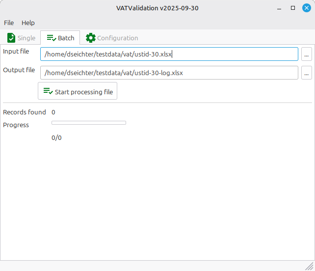

# Graphical User Interface

The VATValidation provides a graphical user interface for single and batch validation. It can be used on every workplace and does not need to be installed or any other 3rd party components.

## Single Validation

You can use the software at your workplace and check directly against the official supported interfaces of BZSt, VIES and/or HMRC.

## Batch Validation

Export your master data into a file (JSON, XLSX or CSV) format and check them completly. The codepage should be UTF-8.

The imported files needs to include the following fields/columns. In case of CSV and XLSX, please add the field names into the first row. Do not add more columns.

* key1
* key2
* ownvat
* foreignvat
* company
* street
* zip
* town

The output file (logfile) contains the following information:

* key1
* key2
* ownvat
* foreignvat
* type
* valid
* errorcode
* errorcode_description
* valid_from
* valid_to
* timestamp
* company
* address
* town
* zip
* street

Depending on your imported data and used interface, some keys won't have values.
