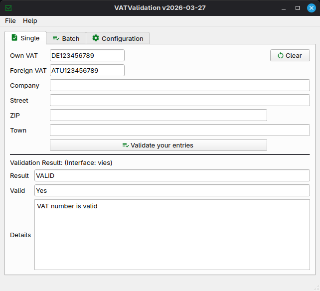

# VATValidation

Validate VAT numbers using the interfaces of VIES and/or HMRC. Provides single or batch validation with support for CSV, XLSX and JSON.

Binaries for Windows and Linux are available (see [releases](https://github.com/dseichter/VATValidation/releases)).

## Features

- 🖥️ Graphical user interface
- ✅ Single VAT number validation
- 📦 Batch processing of CSV, JSON, or XLSX
- 🇪🇺 Validation using VIES
- 🇬🇧 Validation using HMRC (including VAT IDs beginning with `UK`)
- 🛠️ CLI batch processing (see [commandine](commandline.md))
- 🔒 **NO** external dependencies required

Since 2026 the BZSt interface has been shutdowned.

This is the successor of my VAT-Validation. Now released as Open Source.

If you like this software, please don't hesitate to give it a :star: or send me a :moneybag: donation in the amount you think the software is worth.
