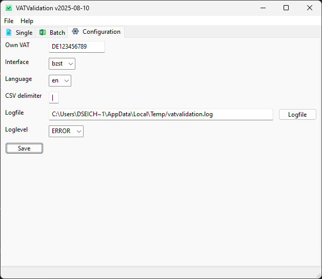

# Configuration

The configuration is done really simple. Change to the configuration tab and enter your own vat. This will be used for the single validation as default VAT. 
Next to this, you can choose your default interface. If you own a german VAT, it is recommended to use BZSt. Change the language of your output.

In case you are using CSV, you can choose the delimiter for your import and export files.
